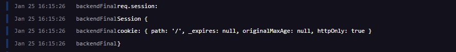

# Link deploy Backend

https://backendfinal-production-c834.up.railway.app

# Link deploy Frontend

https://backend-final-front-keh6.vercel.app

# Link repositorios

https://github.com/RibLucas23/backendFinal

https://github.com/RibLucas23/backendFinal-Front

---

# IMPORTANTE LEER!

Cuando hago el console.log de req.session me devuelve bien la cookie con todos los datos del usuario

Esta es la vista del console.log(req.session) con todos los datos del usuario

pero despues cuando hago el console.log(req.session) en el midleware que bloquea el acceso a las rutas protegidas me devuelve lo siguiente

(esto es lo que me devuelve) me devuelve la cookie vacia sin ningun dato del usuario

en mongo se esta creando la session pero se crea vacia

osea que acceso a la DB desde el front tengo

pero cuando hago el login desde el deploy del backend me guarda perfecto la cookie de la session con todos los datos del usuario

Estuve las ultimas semanas intentando arreglar ese problema pero no encuentro solucion.

Asi que porfavor le pido si puede hacer "npm run dev" en su pc para poder correrlo de localhost para tener las vistas.

Si usted profe descubre el error, le agradeceria muchisimo que me lo diga asi puedo subir mi trabajo a mi porfolio, muchas gracias profe, explico muy bien durante el curso!
